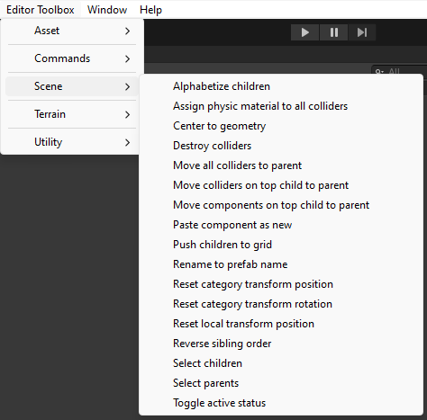
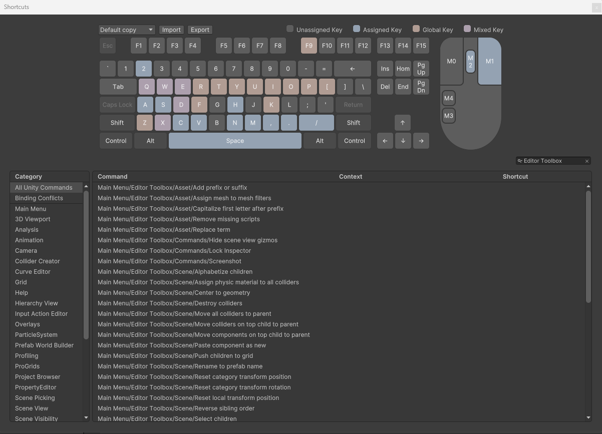

# Editor Toolbox

## Introduction

This is a collection of Editor commands and utilities for Unity3d.

I currently maintain this in version 2022.3.5f1 URP, though it should be fine for many other versions of Unity as well.

## Usage

All Editor commands make use of Unity's [MenuItem] attribute, which makes them available in the toolbar. 

An additional feature of the [MenuItem] attribute is that we can assign hotkeys to our commands by going to Edit -> Shortcuts. 

Though assigning shortcuts and clearing conflicts takes a bit of time, this set of editor commands is designed to be a helpful productivity boost for those who like having access to a wide range of shortcuts.

We can also use Unity's search window as a way to run commands.

One final way to run commands is to right click on game objects in the scene.

## Installation

Move the contents of ./Editor/ into any Editor folder within your project. Note that the scriptable object EditorToolboxSettings must remain inside a Resources folder.

## Guide

Unfontunately, we cannot include tooltips in the toolbar with [MenuItem] attributes. If you need to know more about a command, please open up EditorCommands.cs in your favorite text edit, press "Ctrl + F" to search the relevant command name, then read the summary information. Documentation will be generated soon.